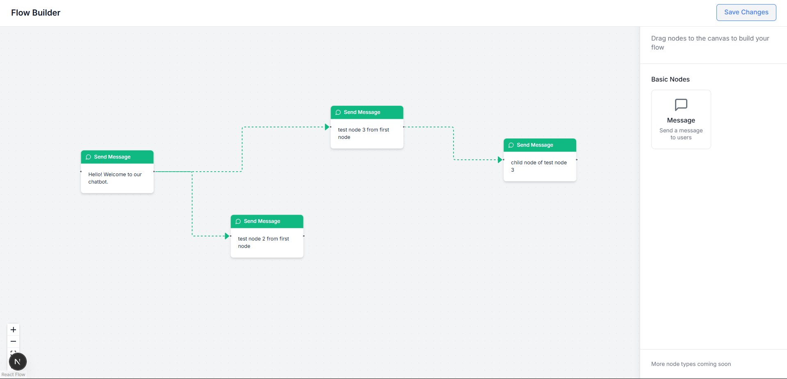

# Flow Builder

This project is an interactive Flow Builder web application built with [Next.js](https://nextjs.org). It allows users to visually create, edit, and manage message flows using a drag-and-drop interface. The builder is designed for scenarios such as chatbot design, automated messaging workflows, or any process that benefits from a node-based visual editor.





## Features

- **Visual Flow Canvas:** Drag and drop nodes to create message flows.
- **Customizable Nodes:** Each node can represent a message or action, with editable settings.
- **Node Panel:** Easily add new nodes from a side panel.
- **Settings Panel:** Configure properties of selected nodes.
- **Top Bar:** Access common actions and controls for the flow.
- **Modern UI:** Built with reusable React components and styled for a clean, intuitive experience.

---

This is a [Next.js](https://nextjs.org) project bootstrapped with [`create-next-app`](https://nextjs.org/docs/app/api-reference/cli/create-next-app).

## Clone the Repository

To get started, first clone the repository:

```bash
git clone https://github.com/AtulRaghuvanshi73/Flow-Builder
cd Flow-Builder

npm i 
#or 
yarn add
#or 
pnpm i 
```

## Getting Started

First, run the development server:

```bash
npm run dev
# or
yarn dev
# or
pnpm dev
```


